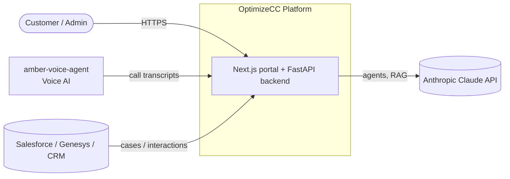
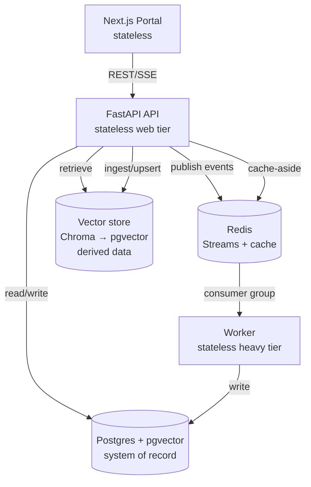
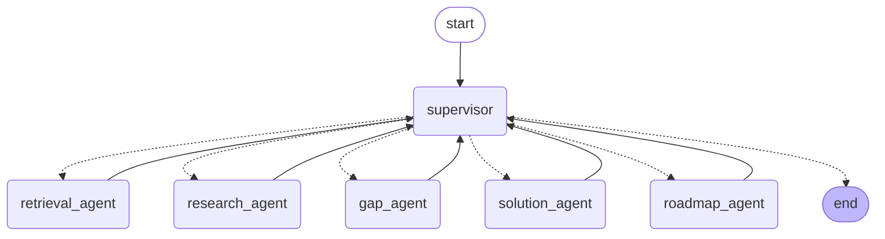
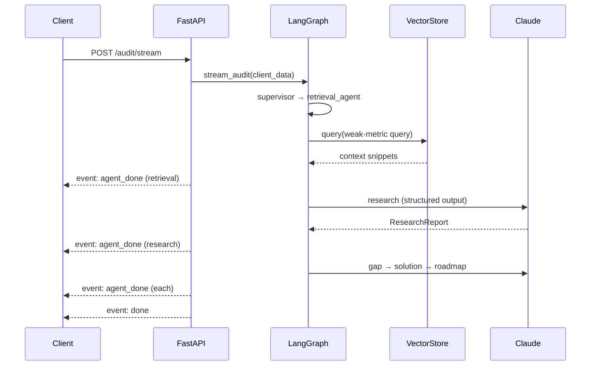
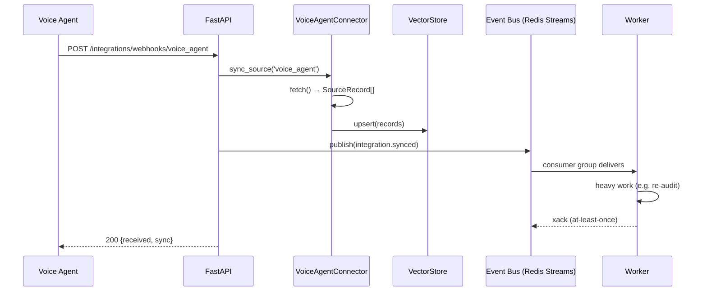

# C4 + Flow Diagrams (Mermaid)

Renderable diagrams (GitHub, VS Code Mermaid preview, mermaid.live). ASCII versions live in
[`../architecture.md`](../architecture.md); this file is the rendered companion.

---

## C4 L1 — System Context



---

## C4 L2 — Containers



---

## C4 L3 — Backend Components

```mermaid
flowchart TB
    subgraph endpoints [api/v1/endpoints]
        ep_audit[audit.py\nrun + stream SSE]
        ep_int[integrations.py\nlist/sync/webhooks]
        ep_core[auth / clients / industry_players]
    end
    subgraph agents [agents/ — LangGraph]
        graph[graph.py\nsupervisor]
        nodes[nodes.py\n5 specialists]
        state[state.py\nAuditState + schemas]
    end
    subgraph rag [rag/]
        store[store.py\nVectorStore port + Chroma]
        retrieve[retrieve.py]
        ingest[ingest.py]
    end
    subgraph integ [integrations/]
        base[base.py\nSourceConnector + registry]
        sync[sync.py]
        conns[voice / salesforce adapters]
    end
    subgraph events [events/]
        bus[bus.py / redis_bus.py\nfactory.py]
    end

    ep_audit --> graph --> nodes --> state
    nodes --> retrieve --> store
    ep_int --> sync --> base
    sync --> store
    sync --> bus
    conns --> base
    ep_core --> pgmodels[(models/ + core/database)]
```

---

## Agent pipeline (live, from `audit_graph.draw_mermaid()`)



---

## Sequence — Run an audit (SSE streaming)



---

## Sequence — Voice→RAG ingestion (event-driven)


